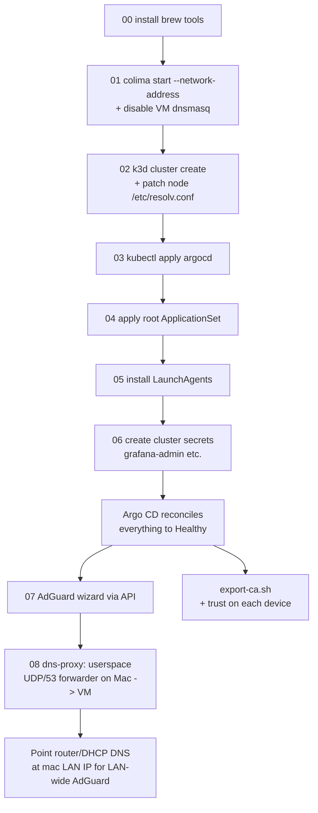

# bootstrap

Scripts that take a fresh Intel Mac from zero → fully working homelab cluster.
After this runs, [Argo CD](https://argo-cd.readthedocs.io/) owns everything;
the only ongoing workflow is `git push`.

## TL;DR

```bash
git clone https://github.com/scepion1d/homelab-iac.git && cd homelab-iac
chmod +x bootstrap/*.sh

# One-time: provide creds (AdGuard password is required, the rest optional).
cp bootstrap/.env.example bootstrap/.env
${EDITOR:-vi} bootstrap/.env

./bootstrap/bootstrap.sh
```

When it finishes, `colima status` should show an `address: 192.168.x.y` line
— that's the VM IP the on-Mac DNS forwarder proxies to. AdGuard is
configured, the LAN DNS forwarder is running, and Argo CD is reconciling
everything else.

## What `bootstrap.sh` does

Reads `bootstrap/.env`, then runs the numbered scripts in order. Each is
idempotent — safe to re-run.

| # | Script | What it does |
|---|---|---|
| 00 | [00-install-deps.sh](00-install-deps.sh) | `brew install` colima, docker, k3d, kubectl, helm, kustomize, k9s, stern, argocd |
| 01 | [01-start-runtime.sh](01-start-runtime.sh) | `colima start --network-address` (defaults: 6 CPU, 24 GiB RAM, 100 GiB disk) so the VM gets a LAN-routable IP, then disable the VM's dnsmasq so :53 is free for k3d |
| 02 | [02-create-cluster.sh](02-create-cluster.sh) | `k3d cluster create` per [cluster/k3d-config.yaml](../cluster/k3d-config.yaml) (1 server + 2 agents, Traefik disabled, host ports 80/443/53) + patch each node's `/etc/resolv.conf` to public DNS (so kubelet can pull images after dnsmasq is gone) |
| 03 | [03-install-argocd.sh](03-install-argocd.sh) | `kubectl apply --server-side` the upstream Argo CD stable manifests |
| 04 | [04-bootstrap-apps.sh](04-bootstrap-apps.sh) | `kubectl apply` the root ApplicationSet — Argo CD now owns the cluster |
| 05 | [05-enable-autostart.sh](05-enable-autostart.sh) | Install LaunchAgents from [launchd/](launchd/) so Colima + k3d start at login |
| 06 | [06-cluster-secrets.sh](06-cluster-secrets.sh) | Create cluster-side secrets that aren't in git: `grafana-admin` always (auto-generated password if not in `.env`); `mikrotik-exporter-credentials` and `argocd-notifications-secret` only if the matching env vars are set |
| 07 | [07-adguard-setup.sh](07-adguard-setup.sh) | Wait for the AdGuard Deployment to come up, port-forward to the wizard, POST the configuration (admin creds from `.env`), wait for rollout |
| 08 | [08-dns-proxy.sh](08-dns-proxy.sh) | Install [dns-proxy.py](dns-proxy.py) as a LaunchDaemon listening on `<mac-lan-ip>:53/udp` and proxying to the Colima VM. Also opens the macOS application firewall for `python3` + `colima` if the firewall is on |

`bootstrap.sh` finishes by printing the Argo CD initial admin password
(`argocd-initial-admin-secret`). The grafana admin password (if 06
generated one) is printed at the end of step 06.

## bootstrap/.env

Copy `bootstrap/.env.example` to `bootstrap/.env` and edit. The file is
in `.gitignore`. Every numbered script sources it via `lib.sh::load_env`.

| Var | Required | Purpose |
|---|---|---|
| `ADGUARD_USER` | yes | Admin user the wizard creates in step 07 |
| `ADGUARD_PASSWORD` | yes | Admin password (bcrypted into the AdGuard PVC; not stored anywhere else) |
| `GRAFANA_ADMIN_PASSWORD` | no | If unset, step 06 auto-generates one and prints it once |
| `MIKROTIK_USER` / `MIKROTIK_PASSWORD` | no | If both set, step 06 creates `mikrotik-exporter-credentials` |
| `SLACK_TOKEN` | no | If set and the notifications secret already exists, step 06 patches it |
| `COLIMA_PROFILE` / `COLIMA_CPU` / `COLIMA_MEMORY` / `COLIMA_DISK` / `COLIMA_NETWORK_ADDRESS` | no | Override Colima defaults |

Defaults for Colima: profile `default`, 6 CPU, 24 GiB RAM, 100 GiB sparse
disk, `--network-address` on. Re-tune later by editing `.env` and re-running:

```bash
colima stop
./bootstrap/01-start-runtime.sh
```

## Secrets (created automatically, mostly)

`06-cluster-secrets.sh` handles the cluster-side secrets Argo CD apps need.
The two below still require you to do something by hand:

### Argo CD: Git repo credentials (PAT, only for the private repo)

So Argo CD can pull from this private repo:

```bash
source scripts/argocd-login.sh && argocd-login
argocd repo add https://github.com/scepion1d/homelab-iac.git \
  --username scepion1d \
  --password github_pat_YOUR_TOKEN
```

GitHub → Settings → Developer settings → Personal access tokens (fine-grained) →
read-only on `Contents` for this repo.

### AdGuard upstreams + blocklists

The wizard (step 07) sets up the admin user and binds :53/:80. Upstream
DNS servers and blocklists are still chosen via the UI:
[cluster/apps/adguard/README.md](../cluster/apps/adguard/README.md) sections
"Configure upstream DNS" and "Enable blocklists".

## Trust the in-cluster CA

cert-manager mints a self-signed CA on first sync and signs every ingress
with it. Install the CA on each device you want to use without browser
warnings:

```bash
./bootstrap/export-ca.sh           # writes ./homelab-ca.crt
```

Then follow the per-OS instructions in the comments at the top of
[export-ca.sh](export-ca.sh) (macOS keychain, iOS profile, Android, Linux,
Windows, Firefox).

## Verifying

```bash
kubectl get nodes
kubectl -n argocd get pods
argocd app list                    # everything should reach Synced + Healthy
```

App-by-app sync progress in the Argo CD UI: `https://argocd.int` or
`https://argocd.localhost` (after trusting the CA).

## Gotchas

### LAN DNS on :53 — vmnet + userspace forwarder on the Mac

Making AdGuard reachable on UDP/53 from the LAN takes two pieces:

1. **The VM needs a routable IP** (so the Mac itself can hit it without going
   through Lima's TCP-only SSH tunnel). [01-start-runtime.sh](01-start-runtime.sh)
   passes `--network-address`; `colima status` then shows a vmnet IP
   (commonly `192.168.64.x` on macOS shared-vmnet, or `192.168.106.x` on
   bridged setups).
2. **LAN clients need a path to it.** The vmnet subnet is private to the
   Mac — phones and laptops on `192.168.10.0/24` can't reach
   `192.168.64.3` on their own. Two ways to fix it:

#### 2a. Userspace UDP/53 forwarder on the Mac (default, automated)

[08-dns-proxy.sh](08-dns-proxy.sh) installs [dns-proxy.py](dns-proxy.py)
to `/usr/local/lib/homelab/dns-proxy.py` and a LaunchDaemon
([launchd-system/com.homelab.dns-proxy.plist](launchd-system/com.homelab.dns-proxy.plist))
that runs it as root, bound to the Mac's LAN IP on `53/udp`. Every
incoming query is relayed to the Colima VM IP on UDP/53 via a fresh
ephemeral socket, and the reply is sent back to the original client.

```bash
./bootstrap/08-dns-proxy.sh   # safe to re-run any time the VM IP changes
```

Clients then point at the **Mac's LAN IP**. MikroTik DHCP / static DNS:
`adguard.int -> <mac-lan-ip>`, etc.

> **Re-run when:** Colima is recreated (`colima delete && colima start`)
> or the Mac's LAN IP changes (new Wi-Fi).

**Why not pf NAT?** The original 06 script used pf `rdr`/`nat` to forward
`<mac-lan-ip>:53/udp` to the VM. On the wire that worked, but Windows
clients silently dropped every reply with `DropReason INET: checksum is
invalid` (pktmon, tcpip.sys L3/L4). Apple's pf is a 15-year-old fork of
OpenBSD pf — its `scrub` directive does not recompute UDP checksums
after NAT rewrite, and the Wi-Fi driver does not expose a `txcsum` knob
to disable hardware checksum offload (`ifconfig en1 -txcsum` →
"does not support"). The forwarder sidesteps the whole class of bug by
letting the kernel build fresh UDP packets in both directions. The
upgrade path in 08-dns-proxy.sh tears the old pf anchors down
automatically.

#### 2b. Static route via the Mac (no forwarder, no rewrite)

If you'd rather not run pf, give the LAN a route to the vmnet subnet:

```bash
# On the Mac: enable forwarding
sudo sysctl -w net.inet.ip.forwarding=1
echo 'net.inet.ip.forwarding=1' | sudo tee -a /etc/sysctl.conf
```

```
# On MikroTik: route the vmnet subnet via the Mac's LAN IP
/ip route add dst-address=192.168.64.0/24 gateway=<mac-lan-ip>
```

Clients then point straight at the **VM IP**. Skip step 08.

#### Bonus context — the in-VM gotchas (handled by 01/02)

Even with the routing piece solved, two things bite on a fresh VM:

1. **VM dnsmasq holds :53.** Colima's VM ships with dnsmasq listening on
   `:53` inside the VM, which Lima forwards to host `:53/tcp`. k3d's
   serverlb then can't bind the same port ("address already in use").
   Fix: [01-start-runtime.sh](01-start-runtime.sh) disables it right after
   `colima start`.
2. **Disabling dnsmasq breaks node DNS.** k3d nodes were resolving via
   Docker's internal resolver → forwarded to dnsmasq → now dead. Image pulls
   start failing on step 03. Fix: [02-create-cluster.sh](02-create-cluster.sh)
   writes `nameserver 1.1.1.1 / 9.9.9.9` into each k3d node's
   `/etc/resolv.conf` immediately after `k3d cluster create`.

#### Why not Lima `portForwards`?

Earlier attempts tried to publish UDP/53 by editing
`~/.colima/_lima/colima/lima.yaml`. That path is broken: Colima owns the
file and any external edit causes the next `limactl start` to recreate the
instance from `template:default` (fresh image download, fresh disk — your
cluster is gone). The portForward never registers anyway.
## Teardown / rebuild

```bash
./bootstrap/teardown.sh            # remove LaunchAgents, delete cluster, stop Colima
./bootstrap/teardown.sh --purge    # also delete the Colima profile (loses cached images)
./bootstrap/bootstrap.sh           # rebuild
```

Teardown does **not** uninstall brew tooling and does **not** touch the secrets
listed above — those live only in the cluster, so deleting the cluster
deletes them. You'll need to recreate them after the next `bootstrap.sh`.

## Recovery (`heal.sh`)

After `colima stop && colima start` (or a Mac sleep/wake cycle), the
k3d serverlb sometimes crash-loops with
`nginx: [emerg] host not found in upstream "k3d-homelab-agent-X:443"`,
and **`k3d cluster start` can't bring it back**. Symptoms: kubectl times
out, `https://argocd.int` is unreachable, the host-side dns-proxy times
out (`dig @192.168.10.3 cloudflare.com` → `connection timed out`).

When that happens, run:

```bash
./bootstrap/heal.sh
```

It is idempotent and will:

1. Restart the Colima VM if its DNS is wedged (`docker pull` fails).
2. Re-`mask` `dnsmasq` inside the VM (regression-proofs the upgrade path
   from older deployments that only `disabled` it).
3. Restart the k3d node containers so kubelets re-register their IPs
   (fixes `kubectl logs` returning `502 Bad Gateway`).
4. If the k3d serverlb is missing or crash-looping, install five
   `alpine/socat` bridges to publish 6443 (→ host :6445), 80, 443, and
   53 UDP/TCP from the VM into `k3d-homelab-server-0`.
5. Re-point `kubectl` at whichever apiserver port is now correct.
6. Smoke-test ingress and DNS.

The same logic runs automatically on next login via
[launchd/com.homelab.k3d.plist](launchd/com.homelab.k3d.plist).

**When to stop healing and rebuild:** if heal.sh runs cleanly but
metrics/UIs still don't work, or if the socat fallback stack feels
unsustainable, the heavy hammer is `./bootstrap/teardown.sh &&
./bootstrap/bootstrap.sh` — that gives you a real k3d serverlb back at
the cost of the AdGuard PVC (filter lists; re-tick them in the UI).

## Operational restart (`restart.sh`)

For a deterministic full runtime restart (Colima + k3d + healing + DNS
proxy refresh), run:

```bash
./bootstrap/restart.sh
```

This is useful after host reboot/sleep, or when DNS/ingress look stale.
It will:

1. Restart the Colima profile.
2. Re-run [01-start-runtime.sh](01-start-runtime.sh) to keep VM prerequisites
   in place (`dnsmasq` masked).
3. Start the existing `homelab` k3d cluster.
4. Run [heal.sh](heal.sh).
5. Re-run [08-dns-proxy.sh](08-dns-proxy.sh) so the forwarder tracks VM IP
   changes.

## Order of operations diagram


